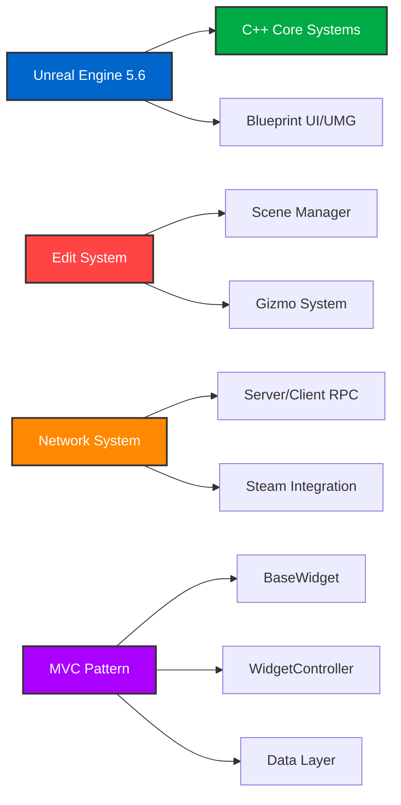

# ThirdMotion
## ✓ Project Overview

<table border="0" cellspacing="0" cellpadding="8" style="width: 100%; table-layout: fixed;">
  <tr>
    <td style="width: 20%; padding: 8px;"><strong>Project Name</strong></td>
    <td style="padding: 8px;">ThirdMotion - 3D Actor/Mesh/Light/Camera 편집 툴</td>
  </tr>
  <tr>
    <td style="padding: 8px;"><strong>Duration</strong></td>
    <td style="padding: 8px;">2025.10.01 - 2025.11.03 (33 days)</td>
  </tr>
  <tr>
    <td style="padding: 8px;"><strong>Engine</strong></td>
    <td style="padding: 8px;">Unreal Engine 5.6</td>
  </tr>
  <tr>
    <td style="padding: 8px;"><strong>Language</strong></td>
    <td style="padding: 8px;">C++ & Blueprint</td>
  </tr>
  <tr>
    <td style="padding: 8px;"><strong>Purpose</strong></td>
    <td style="padding: 8px;">UE5 멀티플레이어 기반 협업 3D 편집 툴 개발 프로젝트</td>
  </tr>
</table>

## ✓ Tool & Skill

  ### Game Development
  
  
  

  ### Version Control
  
  

  ### Network
  

## ✓ Technical Architecture

### Core Technologies

### 주요 담당 영역 (담당 영역 구현 100%)
- **본인**: UI/UX 디자인, TopBar/BottomBar, ViewportWidget, Light System, Voice Chat, Memo System, 접속자 리스트, 카메라 시스템, 네트워크 구축
- **타 팀원**: Gizmo System, Scene Manager, Library Panel, Mesh/Material 변경
  
## ✓ 주요 기능

### 1. 네트워크 협업 시스템
- **Host/Join 기능**: Steam 세션 기반 멀티플레이어
- **실시간 동기화**: 액터 스폰/트랜스폼/메시/머티리얼 변경 동기화
- **Voice Chat**: Steam Voice Chat Plugin 통합
- **User List**: 접속한 사용자 실시간 표시

### 2. 액터 편집 시스템
- **Library Panel**: 카테고리별 Preset (Furniture, Light, Camera, Mesh)
- **Preview Ghost**: 배치 전 미리보기 기능
- **Gizmo System**: Location/Rotation/Scale 조작
- **Align Mode**: World/Local 좌표계 전환
- **XYZ Panel**: 수치 입력을 통한 정밀 트랜스폼 조정
- **Highlight**: 선택된 액터 강조 표시

### 3. Material & Mesh 시스템
- **Color Picker**: 실시간 색상 선택 및 적용
- **Material Generation**: 런타임 머티리얼 생성
- **Preview Image**: 머티리얼 썸네일 자동 생성
- **Mesh/Material Combo**: 드롭다운으로 쉽게 변경
- **Data Table**: 머티리얼 데이터 관리

### 4. Light 시스템
- **4가지 Light Type**: Directional/Point/Spot/Rect Light
- **Light Preset**: 사전 정의된 라이트 템플릿
- **실시간 조정**: Intensity, Color, Angle, Attenuation 조절

### 5. Camera 시스템
- **WASD + QE**: 자유로운 카메라 이동
- **RMB 드래그**: 시점 회전
- **다각도 View**: Front/Back/Top/Bottom/Left/Right 빠른 전환

### 6. UI/UX
- **MVC Pattern**: BaseWidget → WidgetController → Data 구조
- **TopBar**: File 메뉴, Gizmo 모드, User List
- **BottomBar**: Scene/View/Materials/Memo 탭 전환
- **RightPanel**: Properties 패널 (Actor별 동적 구성)
- **ViewportWidget**: 3D 뷰포트 통합

### 7. File System
- **Save/Load**: SaveGame을 통한 씬 저장/불러오기
- **Scene List**: 배치된 Actor 목록 및 필터링
- **Delete**: Actor 삭제 기능

### 8. Memo System
- **메모 작성**: 협업 중 메모 공유 기능
- **Persistent**: 저장/불러오기 지원

**개발 기간**: 2025.10.01 - 2025.11.03 (33일)
**총 커밋 수**: 318 commits
**팀원**: 3명

Made with Unreal Engine 5.6

