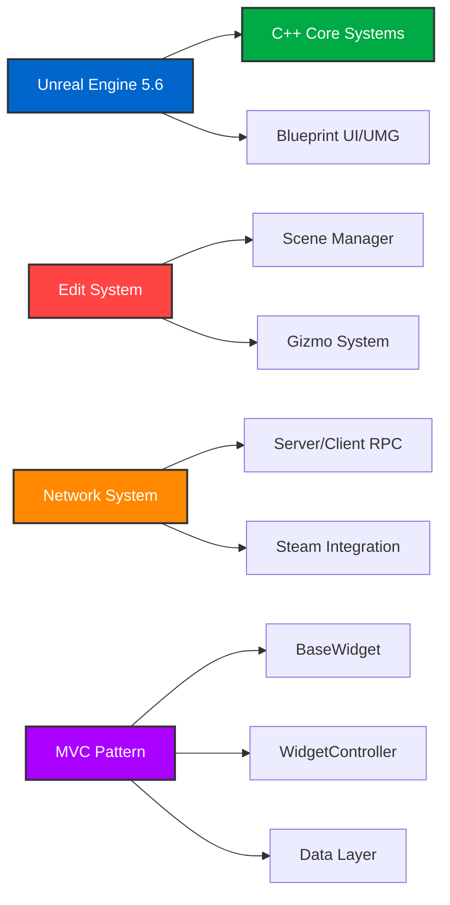

# ThirdMotion
## ✓ Project Overview
<div align="center">

<table border="0" cellspacing="0" cellpadding="8" style="width: 100%; table-layout: fixed;">
  <tr>
    <td style="width: 20%; padding: 8px;"><strong>Project Name</strong></td>
    <td style="padding: 8px;">ThirdMotion - 3D Actor/Mesh/Light/Camera 편집 툴</td>
  </tr>
  <tr>
    <td style="padding: 8px;"><strong>Duration</strong></td>
    <td style="padding: 8px;">2025.10.01 - 2025.11.03 (33 days)</td>
  </tr>
  <tr>
    <td style="padding: 8px;"><strong>Team Size</strong></td>
    <td style="padding: 8px;">4 developers (Lauren, eunjung, bsj, HyeseonLikesPizza)</td>
  </tr>
  <tr>
    <td style="padding: 8px;"><strong>Engine</strong></td>
    <td style="padding: 8px;">Unreal Engine 5.6</td>
  </tr>
  <tr>
    <td style="padding: 8px;"><strong>Language</strong></td>
    <td style="padding: 8px;">C++ & Blueprint</td>
  </tr>
  <tr>
    <td style="padding: 8px;"><strong>Version Control</strong></td>
    <td style="padding: 8px;">Git-based collaborative workflow (GitHub)</td>
  </tr>
  <tr>
    <td style="padding: 8px;"><strong>Purpose</strong></td>
    <td style="padding: 8px;">UE5 멀티플레이어 기반 협업 3D 편집 툴 개발 프로젝트</td>
  </tr>
</table>

</div>

## ✓ Tool & Skill
<div align="center">

  ### Game Development
  
  
  

  ### Version Control
  
  

  ### Network
  

</div>

### Commit Guidelines
```
[Feat]: 새로운 기능 추가
[Fix]: 버그 수정
[Temp]: 임시 커밋 (작업 중)
Feat: 기능 구현
Fix: 수정 사항
```

## ✓ Technical Architecture

<div align="center">

### Core Technologies

</div>

## ✓ Development Summary (Prototype → Alpha → Beta)

| 구분 | 프로토타입 (2025-10-01 ~ 10-17) | 알파 (2025-10-18 ~ 10-27) | 베타 (2025-10-28 ~ 11-03) |
|---|---|---|---|
| **핵심 구현** | <ol><li>서버 Listen 구축</li><li>액터 스폰 파이프라인</li><li>Edit 서브시스템 기본 뼈대</li><li>Library 패널 및 카테고리 시스템</li><li>프리뷰 고스트 기능</li><li>액터 스폰 네트워크 동기화</li></ol> | <ol><li>런타임 Gizmo (Location/Rotation/Scale)</li><li>액터 선택 하이라이트</li><li>TopBar/BottomBar UI 디자인</li><li>카메라 WASD+QE 움직임</li><li>다각도 View 전환 (Front/Back/Top/Bottom/Left/Right)</li><li>Static Mesh/Material 변경 시스템</li><li>Color Picker 및 Material 생성</li></ol> | <ol><li>XYZ 패널 (트랜스폼 수치 입력)</li><li>Light 시스템 (Directional/Point/Spot/Rect)</li><li>Memo 시스템</li><li>Steam Voice Chat</li><li>Material Preview 이미지 생성</li><li>Scene List 필터링/삭제</li><li>네트워크 트랜스폼/메시/머티리얼 동기화</li></ol> |
| **구조(Architecture)** | <ol><li>BaseWidget/BaseWidgetController MVC 골격</li><li>SceneManager 설정</li><li>Library 데이터테이블 구조</li><li>GameMode/PlayerController Framework</li></ol> | <ol><li>Panel 시스템 분리 (Library/RightPanel/TopBar/BottomBar)</li><li>WidgetController 체계 확립</li><li>Gizmo Align Mode (World/Local)</li><li>AssetResolver 시스템</li></ol> | <ol><li>BottomView Switcher 구조</li><li>Properties 패널 동적 구성</li><li>ServerController/ServerManager 네트워크 레이어</li><li>SaveGameManager 구현</li><li>EditSyncComponent 분리</li></ol> |
| **Flow<br>(UI/게임 진행)** | <ol><li>Main Menu (Host/Join)</li><li>MainWidget 기본 레이아웃</li><li>Loading Screen 설정</li><li>ViewportWidget 통합</li></ol> | <ol><li>File 메뉴 (Open/Save)</li><li>User List 표시</li><li>Viewport UI 완성</li><li>BottomBar Toggle 연동</li><li>MaterialGeneratePanel 기초</li></ol> | <ol><li>Properties 패널 Actor별 분기</li><li>Light Widget 완성</li><li>Memo Widget 완성</li><li>접속 User List 실시간 갱신</li><li>Voice Chat 통합</li><li>Scene/View/Materials/Memo 4가지 Bottom View</li></ol> |

## ✓ 주요 기능

### 1. 네트워크 협업 시스템
- **Host/Join 기능**: Steam 세션 기반 멀티플레이어
- **실시간 동기화**: 액터 스폰/트랜스폼/메시/머티리얼 변경 동기화
- **Voice Chat**: Steam Voice Chat Plugin 통합
- **User List**: 접속한 사용자 실시간 표시

### 2. 액터 편집 시스템
- **Library Panel**: 카테고리별 Preset (Furniture, Light, Camera, Mesh)
- **Preview Ghost**: 배치 전 미리보기 기능
- **Gizmo System**: Location/Rotation/Scale 조작
- **Align Mode**: World/Local 좌표계 전환
- **XYZ Panel**: 수치 입력을 통한 정밀 트랜스폼 조정
- **Highlight**: 선택된 액터 강조 표시

### 3. Material & Mesh 시스템
- **Color Picker**: 실시간 색상 선택 및 적용
- **Material Generation**: 런타임 머티리얼 생성
- **Preview Image**: 머티리얼 썸네일 자동 생성
- **Mesh/Material Combo**: 드롭다운으로 쉽게 변경
- **Data Table**: 머티리얼 데이터 관리

### 4. Light 시스템
- **4가지 Light Type**: Directional/Point/Spot/Rect Light
- **Light Preset**: 사전 정의된 라이트 템플릿
- **실시간 조정**: Intensity, Color, Angle, Attenuation 조절

### 5. Camera 시스템
- **WASD + QE**: 자유로운 카메라 이동
- **RMB 드래그**: 시점 회전
- **다각도 View**: Front/Back/Top/Bottom/Left/Right 빠른 전환

### 6. UI/UX
- **MVC Pattern**: BaseWidget → WidgetController → Data 구조
- **TopBar**: File 메뉴, Gizmo 모드, User List
- **BottomBar**: Scene/View/Materials/Memo 탭 전환
- **RightPanel**: Properties 패널 (Actor별 동적 구성)
- **ViewportWidget**: 3D 뷰포트 통합

### 7. File System
- **Save/Load**: SaveGame을 통한 씬 저장/불러오기
- **Scene List**: 배치된 Actor 목록 및 필터링
- **Delete**: Actor 삭제 기능

### 8. Memo System
- **메모 작성**: 협업 중 메모 공유 기능
- **Persistent**: 저장/불러오기 지원

## ✓ 프로젝트 구조

```
Source/ThirdMotion/
├ Public/
│ ├ Framework/
│ │ ├ ThirdMotionGameMode.h
│ │ ├ ThirdMotionPlayerController.h
│ │ └ ThirdMotionGameInstance.h
│ ├ UI/
│ │ ├ Widget/
│ │ │ ├ BaseWidget.h
│ │ │ ├ MainWidget.h
│ │ │ ├ ViewportWidget.h
│ │ │ ├ MemoWidget.h
│ │ │ └ Library/
│ │ ├ Panel/
│ │ │ ├ TopBar.h
│ │ │ ├ BottomBar.h
│ │ │ ├ RightPanel.h
│ │ │ ├ LibraryPanel.h
│ │ │ └ MaterialGeneratePanel.h
│ │ └ WidgetController/
│ │   ├ BaseWidgetController.h
│ │   ├ LibraryWidgetController.h
│ │   ├ MeshWidgetController.h
│ │   ├ XYZWidgetController.h
│ │   └ LightController.h
│ ├ Edit/
│ │ ├ SceneManager.h
│ │ ├ AssetResolver.h
│ │ ├ HighlightComponent.h
│ │ ├ LightEditLibrary.h
│ │ ├ PreviewImageGenerator.h
│ │ └ MemoActor.h
│ ├ Network/
│ │ ├ ServerController.h
│ │ └ ServerManager.h
│ ├ Save/
│ │ ├ SaveGameManager.h
│ │ └ ThirdMotionSaveGame.h
│ └ Data/
│   ├ LibraryItemObject.h
│   ├ MaterialDataTypes.h
│   ├ MeshDataRow.h
│   ├ SceneItemData.h
│   └ ViewportTypes.h
└ Private/
  └ [Implementation Files]
```

## ✓ 개발 타임라인

### 프로토타입 단계 (2025.10.01 - 10.17)
- **Week 1 (10.01-10.08)**: 프로젝트 초기 설정, 서버 구축, 액터 스폰 구조 설계
- **Week 2 (10.09-10.13)**: Edit 서브시스템, Library 위젯, SceneManager 구현
- **Week 3 (10.14-10.17)**: Library Panel 완성, 프리뷰 고스트, 네트워크 동기화

### 알파 단계 (2025.10.18 - 10.27)
- **Week 1 (10.18-10.20)**: Gizmo 시스템, 하이라이트, Light 편집, UI 디자인
- **Week 2 (10.21-10.24)**: TopBar/BottomBar 완성, Gizmo Rotation/Scale, Material Panel
- **Week 3 (10.25-10.27)**: Mesh/Material 변경, Color Picker, 카메라 시스템, Steam 연동

### 베타 단계 (2025.10.28 - 11.03)
- **Week 1 (10.28-10.31)**: XYZ 패널, Light 시스템, Memo 시스템, Voice Chat
- **Final Week (11.01-11.03)**: 최종 통합, Properties 패널 완성, 버그 픽스, 마무리

## ✓ 팀 역할 분담

<table align="center">
<tr>
<td align="center" width="25%">
<strong>Lauren<br>(HyeseonLikesPizza)</strong><br>
<code>[Core System]</code><br>
<small>87 commits</small>
</td>
<td align="center" width="25%">
<strong>eunjung</strong><br>
<code>[UI/UX]</code><br>
<small>168 commits</small>
</td>
<td align="center" width="25%">
<strong>bsj</strong><br>
<code>[Material System]</code><br>
<small>20 commits</small>
</td>
<td align="center" width="25%">
<strong>heekki2024</strong><br>
<code>[Integration]</code><br>
<small>1 commit</small>
</td>
</tr>
</table>

### 주요 담당 영역
- **Lauren**: Gizmo System, Scene Manager, Library Panel, Mesh/Material 변경, 카메라 시스템, 네트워크 동기화
- **eunjung**: UI/UX 디자인, TopBar/BottomBar, ViewportWidget, Light System, Voice Chat, Memo System, 접속자 리스트
- **bsj**: Material Generate Panel, Color Picker, Preview Image Generator, Material Detail Panel
- **heekki2024**: PR 관리 및 통합

## ✓ KPT 회고 (Keep-Problem-Try)

<div style="width:100%; overflow-x:auto; -webkit-overflow-scrolling:touch;">
<table border="0" cellspacing="0" cellpadding="12"
  style="width:100%; max-width:100%; border-collapse:collapse; font-family:sans-serif; table-layout:auto;">
  <!-- KEEP -->
  <tr><td style="background-color:#e8f5e8; border:1px solid #cfe9cf;"><strong>🟢 KEEP</strong></td></tr>
  <tr>
    <td style="background-color:#f8fff8; border:1px solid #cfe9cf; overflow-wrap:anywhere; word-break:break-word;">
      <ul style="margin:0.5em 0 0 1.2em;">
        <li><strong>명확한 역할 분담</strong> — 각자의 담당 영역을 확실히 정해 효율적인 병렬 작업 진행</li>
        <li><strong>Git 브랜치 전략</strong> — 개인 브랜치(Lauren/CEJ/BSJ)로 독립적 작업 후 main 머지</li>
        <li><strong>MVC 패턴 준수</strong> — BaseWidget/Controller 구조로 유지보수성 향상</li>
        <li><strong>빈번한 커밋</strong> — 하루 평균 10+ 커밋으로 작업 진행 상황 투명하게 관리</li>
        <li><strong>네트워크 동기화 체계</strong> — ServerController/ServerManager 레이어로 깔끔한 네트워크 로직 분리</li>
        <li><strong>데이터테이블 활용</strong> — Library/Material/Mesh 데이터를 데이터테이블로 관리하여 확장성 확보</li>
      </ul>
    </td>
  </tr>

  <!-- PROBLEM -->
  <tr><td style="background-color:#fff2e8; border:1px solid #f0d6c5;"><strong>🟡 PROBLEM</strong></td></tr>
  <tr>
    <td style="background-color:#fffaf5; border:1px solid #f0d6c5; overflow-wrap:anywhere; word-break:break-word;">
      <ul style="margin:0.5em 0 0 1.2em;">
        <li><strong>빌드 금지 정책</strong> — 엔진 수정 불가 제약으로 일부 기능 구현에 제한
          <ul style="margin:0.4em 0 0 1.2em;">
            <li>C++ 코드 수정 후 Hot Reload 불안정</li>
            <li>Widget 타입 변경 시 전체 리빌드 필요</li>
          </ul>
        </li>
        <li><strong>네트워크 동기화 복잡도</strong> — Actor 속성 변경 시 클라이언트 간 동기화 타이밍 이슈
          <ul style="margin:0.4em 0 0 1.2em;">
            <li>RPC 호출 순서 보장 어려움</li>
            <li>일부 기능에서 동기화 지연 발생</li>
          </ul>
        </li>
        <li><strong>BP-C++ 혼재</strong> — 로직은 C++, UI는 BP로 분리했으나 디버깅 시 추적 어려움</li>
        <li><strong>초기 기획 변경</strong> — 개발 중 요구사항 변경으로 리팩토링 필요 (예: Properties 패널 구조)
          <ul style="margin:0.4em 0 0 1.2em;">
            <li>"삭제되면 죽음밖에 없음...." 커밋 메시지에서 드러나는 불안정성</li>
          </ul>
        </li>
      </ul>
    </td>
  </tr>

  <!-- TRY -->
  <tr><td style="background-color:#e8f2ff; border:1px solid #c9daf6;"><strong>🔵 TRY</strong></td></tr>
  <tr>
    <td style="background-color:#f5f8ff; border:1px solid #c9daf6; overflow-wrap:anywhere; word-break:break-word;">
      <ul style="margin:0.5em 0 0 1.2em;">
        <li><strong>Text Chat 시스템</strong> — Voice Chat 외에 텍스트 채팅 추가 구현 (bsj 작업 중단)</li>
        <li><strong>다중 선택</strong> — 여러 Actor 동시 선택 및 편집 (구현 시도했으나 Bye)</li>
        <li><strong>Camera Actor</strong> — Camera Preset 저장 및 전환 기능 완성</li>
        <li><strong>Undo/Redo</strong> — 편집 작업 되돌리기 기능 추가</li>
        <li><strong>Animation</strong> — Actor에 애니메이션 적용 기능</li>
        <li><strong>Physics Simulation</strong> — 물리 시뮬레이션 기반 인터랙션</li>
        <li><strong>Import/Export</strong> — FBX/OBJ 등 외부 파일 Import/Export 기능</li>
        <li><strong>Performance Optimization</strong> — 대규모 씬 편집 시 최적화 (LOD, Culling 등)</li>
      </ul>
    </td>
  </tr>
</table>
</div>

## ✓ 기술적 도전과 해결

### 1. 런타임 Gizmo 구현
- **문제**: 언리얼 에디터의 Gizmo를 런타임에서 재현
- **해결**: TransformGizmo Component를 활용한 커스텀 Gizmo 시스템 구축
- **결과**: Location/Rotation/Scale 3가지 모드 + World/Local 좌표계 전환 구현

### 2. 네트워크 동기화
- **문제**: 멀티플레이어 환경에서 실시간 편집 동기화
- **해결**: ServerController/ServerManager 레이어에서 RPC 관리, EditSyncComponent를 통한 액터별 동기화
- **결과**: 스폰/트랜스폼/메시/머티리얼 변경 모두 동기화 성공

### 3. Material Preview 이미지 생성
- **문제**: 런타임에서 생성한 머티리얼의 썸네일 필요
- **해결**: PreviewImageGenerator를 통해 Scene Capture Component로 렌더링
- **결과**: Material Combo Box에 미리보기 이미지 자동 표시

### 4. Steam Voice Chat 통합
- **문제**: 세션 없이 Voice Chat 구현 필요
- **해결**: EOSVoiceChat Plugin 직접 사용 (세션 미사용)
- **결과**: 접속자 간 실시간 음성 통화 기능 구현

### 5. Properties 패널 동적 구성
- **문제**: Actor 타입별로 다른 속성 표시 필요 (Mesh, Light, Camera, Memo)
- **해결**: BottomView Switcher + Actor Tag 기반 분기 처리
- **결과**: Actor 선택 시 자동으로 적절한 Properties 패널 표시

## ✓ 향후 계획

### Phase 1: 기능 완성도 향상
- Text Chat 완성
- Camera Preset 완성
- Undo/Redo 시스템

### Phase 2: 확장성
- Plugin 아키텍처로 전환
- Custom Actor Type 추가 지원
- Material 라이브러리 확장

### Phase 3: 최적화
- 대규모 씬 최적화
- 네트워크 대역폭 최적화
- UI 반응성 개선

### Phase 4: 배포
- Standalone 빌드 안정화
- 사용자 매뉴얼 작성
- 튜토리얼 영상 제작

---

<div align="center">

**개발 기간**: 2025.10.01 - 2025.11.03 (33일)
**총 커밋 수**: 318 commits
**팀원**: 4명

Made with Unreal Engine 5.6

</div>
=======
# ThirdMotion
>>>>>>> d50c9b3 (Initial commit)
